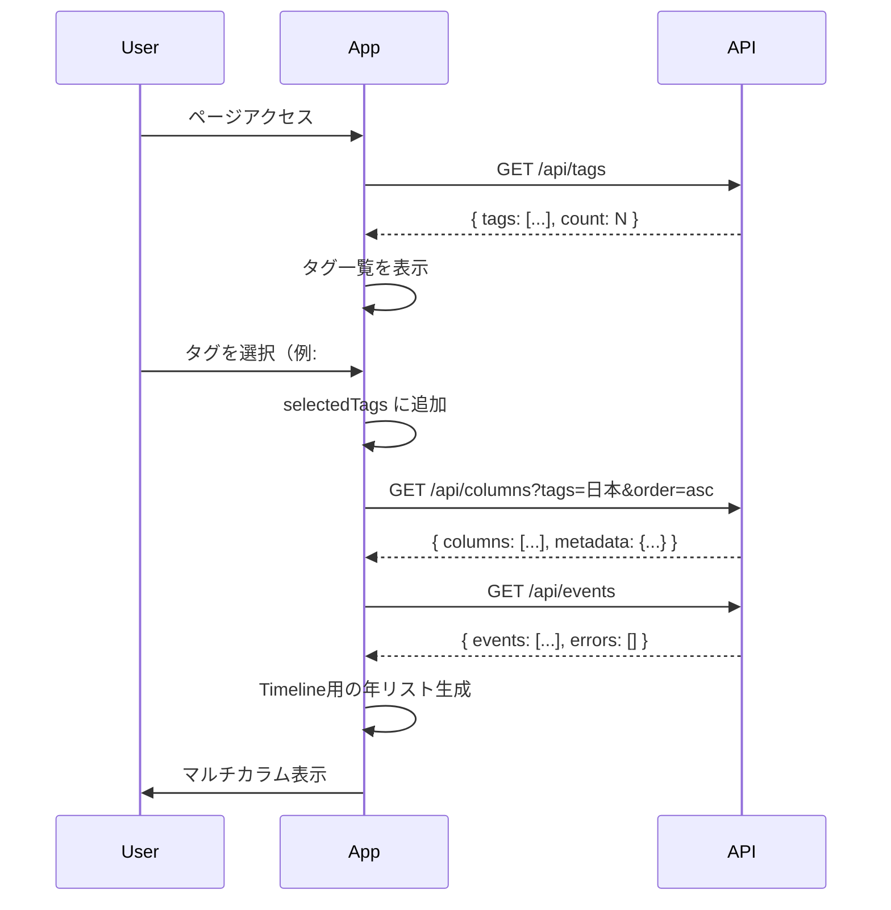
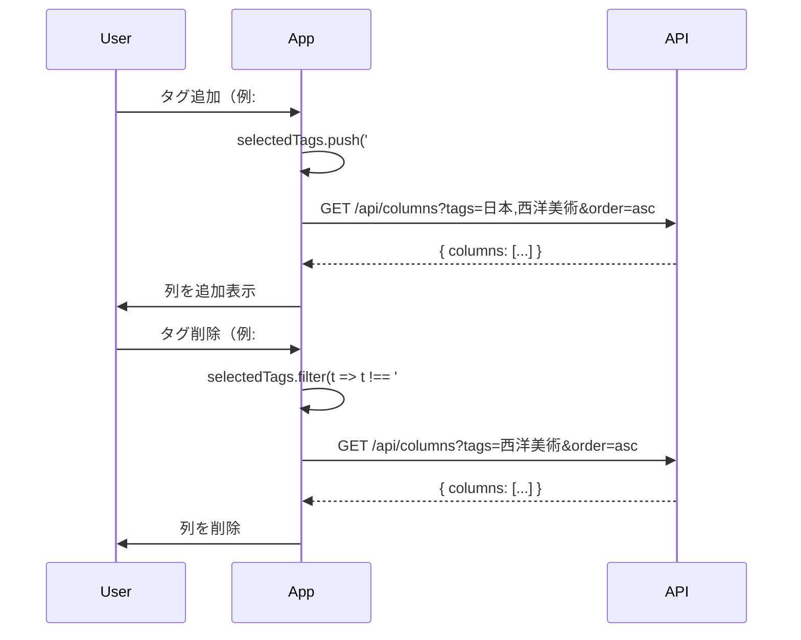
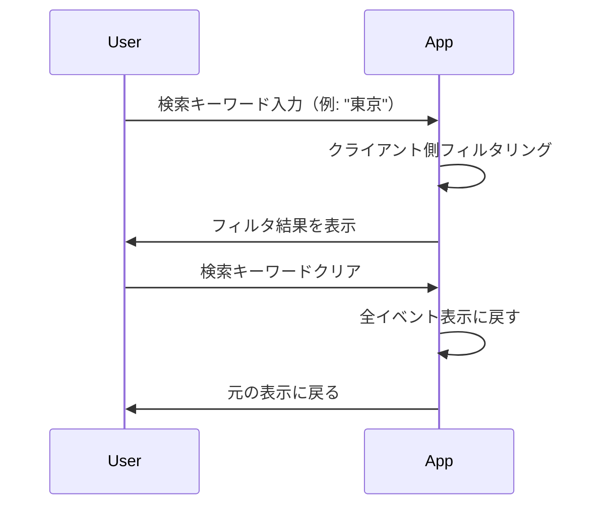

# TimeMosaic - フロントエンド仕様書

## 概要

TimeMosaic のフロントエンド UI/UX 仕様。マルチカラム年表表示を中心に、タグ選択、検索、共通年表による時間軸の可視化を実装する。

**対象フェーズ**: Phase 3 - UI 実装

---

## 核心機能: マルチカラム年表表示

### コンセプト

複数の領域（タグ）のイベントを並列表示し、**共通年表（タイムライン軸）** を配置することで：
- 異なる領域のイベントの **同時代性** を一目で把握できる
- 時間の流れを視覚的に理解できる
- 各領域のイベント密度を比較できる

---

## UI レイアウト構成

### 全体構造

```
┌─────────────────────────────────────────────────────────────────────┐
│ Header: TimeMosaic                                                  │
│ Controls: [検索バー] [並び順: 古い順▼]                              │
│ Tags: [#日本 ×] [#西洋美術 ×] [#科学 ×] [+ タグを追加]              │
├──────────┬─────────────┬──────────────┬──────────────┬─────────────┤
│ Timeline │   #日本      │  #西洋美術    │   #科学      │   (横スクロ │
│  (年表)  │             │              │              │     ール)   │
├──────────┼─────────────┼──────────────┼──────────────┼─────────────┤
│  1543    │ 鉄砲伝来     │              │              │             │
│   │      │ #歴史 #日本  │              │              │             │
│   │      │              │              │              │             │
├───┼──────┼─────────────┼──────────────┼──────────────┼─────────────┤
│   │      │              │              │              │             │
│   │      │              │              │              │             │
│   ▼      │              │              │              │             │
│  1889    │              │ エッフェル塔  │              │             │
│   │      │              │ 完成         │              │             │
│   │      │              │ #建築        │              │             │
├───┼──────┼─────────────┼──────────────┼──────────────┼─────────────┤
│   │      │              │              │              │             │
│   ▼      │              │              │              │             │
│  1945    │ 終戦記念日    │              │              │             │
│   │      │ 1945-08-15   │              │              │             │
│   │      │ #歴史 #日本  │              │              │             │
├───┼──────┼─────────────┼──────────────┼──────────────┼─────────────┤
│   │      │              │              │              │             │
│   ▼      │              │              │              │             │
│  1964    │ 東京五輪開会  │              │              │             │
│   │      │ 1964-10-10   │              │              │             │
│   │      │ #スポーツ    │              │              │             │
├───┼──────┼─────────────┼──────────────┼──────────────┼─────────────┤
│   ▼      │              │              │              │             │
│  1969    │              │              │ アポロ11号    │             │
│   │      │              │              │ 月面着陸     │             │
│   │      │              │              │ #科学 #宇宙  │             │
├───┼──────┼─────────────┼──────────────┼──────────────┼─────────────┤
│   ▼      │              │              │              │             │
│  1970    │ 大阪万博     │ 大阪万博      │              │             │
│   │      │ #文化 #日本  │ #文化 #西洋   │              │             │
│   │      │ #西洋文化    │ #文化        │              │             │
│   │      │              │              │              │             │
│   │      │ ← 同じイベントが複数列に表示される               │             │
└───┴──────┴─────────────┴──────────────┴──────────────┴─────────────┘
```

### レイアウト詳細

#### 1. ヘッダーエリア（固定）

```
┌─────────────────────────────────────────────────────┐
│ TimeMosaic                                          │
│ 歴史イベントをタグで比較する年表ビューア             │
└─────────────────────────────────────────────────────┘
```

**要素**:
- アプリケーション名: `TimeMosaic`
- サブタイトル（オプション）

---

#### 2. コントロールエリア（固定）

```
┌─────────────────────────────────────────────────────┐
│ [🔍 イベントを検索...]  [並び順: 古い順 ▼]          │
└─────────────────────────────────────────────────────┘
```

**要素**:
- **検索バー**: キーワードでイベントをフィルタリング
- **並び順セレクト**: 古い順 / 新しい順

---

#### 3. タグ選択エリア（固定）

```
┌─────────────────────────────────────────────────────┐
│ 選択中: [#日本 ×] [#西洋美術 ×] [#科学 ×]            │
│                                                     │
│ タグ一覧: [#歴史] [#スポーツ] [#建築] [#文化] ...   │
└─────────────────────────────────────────────────────┘
```

**要素**:
- **選択済みタグ**: クリックで削除（`×` ボタン）
- **利用可能なタグ一覧**: クリックで追加
  - API `/api/tags` から取得
  - アルファベット順または使用頻度順でソート

**動作**:
- タグクリック → 列が追加される
- `×` クリック → 列が削除される
- 最大列数制限: 5列（パフォーマンス考慮）

---

#### 4. マルチカラムエリア（横スクロール可能）

##### a) Timeline列（共通年表）

**目的**:
- 全イベントの時間軸を提供
- 異なる領域のイベントの同時代性を可視化
- 時間の経過感を視覚的に正確に表現

**表示内容**:
- 年号のみ表示（`1543`, `1945`, `1964` など）
- 縦線で時間の流れを表現
- 年号は全イベントの年を網羅（選択タグに関係なく）

**デザイン（MVP版：等間隔表示）**:
```
┌──────────┐
│ Timeline │
├──────────┤
│  1543    │
│   │      │
│   ▼      │
│  1868    │
│   │      │
│   ▼      │
│  1889    │
│   │      │
│   ▼      │
│  1945    │
│   │      │
│   ▼      │
│  1964    │
└──────────┘
```

**実装（MVP版）**:
- `/api/events` から全イベントを取得
- 全イベントの年を抽出してソート
- 重複削除
- 年のみのリストを生成
- 各年を等間隔で配置

**将来の拡張: 線形スケール表示（時間軸に比例）**

**課題**:
現在のMVP版では、1543-1868年（325年間）と1945-1964年（19年間）が同じ高さで表示される。
これでは時間の経過感が正確に伝わらない。

**解決策**:
年の間隔を実際の時間に比例させる（線形スケール）。

**デザイン（線形スケール版）**:
```
┌──────────┐
│ Timeline │
├──────────┤
│  1543    │
│   │      │
│   │      │  ← 325年分の高さ
│   │      │
│   │      │
│   │      │
│   ▼      │
│  1868    │
│   │      │  ← 21年分の高さ
│   ▼      │
│  1889    │
│   │      │  ← 56年分の高さ
│   │      │
│   ▼      │
│  1945    │
│   │      │  ← 19年分の高さ
│   ▼      │
│  1964    │
└──────────┘
```

**実装方針**:

```typescript
// 1. 最小年と最大年を取得
const allYears = events.map(e => e.date.year);
const minYear = Math.min(...allYears);
const maxYear = Math.max(...allYears);
const yearRange = maxYear - minYear;

// 2. 各年の位置を計算（0-100%）
const getYearPosition = (year: number): number => {
  return ((year - minYear) / yearRange) * 100;
};

// 3. 年ごとの間隔を計算（ピクセル単位）
const PIXELS_PER_YEAR = 5; // 1年 = 5px（調整可能）
const totalHeight = yearRange * PIXELS_PER_YEAR;

// 4. CSS絶対位置指定で配置
<div className="timeline-container" style={{ height: `${totalHeight}px` }}>
  {uniqueYears.map(year => (
    <div
      key={year}
      className="timeline-year"
      style={{
        position: 'absolute',
        top: `${(year - minYear) * PIXELS_PER_YEAR}px`
      }}
    >
      {year}
    </div>
  ))}
</div>
```

**タグ列のイベント配置も同期**:

```typescript
<div className="tag-column" style={{ height: `${totalHeight}px` }}>
  {column.events.map(event => (
    <EventCard
      key={event.id}
      event={event}
      style={{
        position: 'absolute',
        top: `${(event.date.year - minYear) * PIXELS_PER_YEAR}px`
      }}
    />
  ))}
</div>
```

**調整可能なパラメータ**:
- `PIXELS_PER_YEAR`: 1年あたりのピクセル数
  - 小さい値（2-3px）: コンパクト、スクロール少ない
  - 大きい値（10-20px）: 詳細、スクロール多い
- 最小間隔保証: イベントが密集する年代でも最低限の間隔を確保

**表示例（1年=5pxの場合）**:
- 1543-2011年（468年）→ 2,340px（約2.3画面分のスクロール）
- 1543-1868年（325年）→ 1,625px
- 1945-1964年（19年）→ 95px

**メリット**:
- ✅ 時間の経過が視覚的に正確
- ✅ 歴史の「密度」が分かる（イベントが多い時代 vs 少ない時代）
- ✅ 時代感がより直感的

**デメリット（対策）**:
- ❌ 古い年代は遠くなる → スクロール位置の保存、年代ジャンプ機能
- ❌ イベントが密集する年代で重なる → カード幅調整、ズーム機能
- ❌ 実装が複雑 → MVP後の段階的な実装

**実装スケジュール**:
- Phase 3（MVP）: 等間隔表示
- Phase 6（仕上げ）または Phase 7（拡張）: 線形スケール表示

---

##### b) タグ別カラム

各選択タグごとに1列表示。

**表示内容**:
- 列ヘッダー: タグ名（例: `#日本`）
- イベントカード: そのタグを持つイベントのみ

**データ取得**:
- API `/api/columns?tags=日本,西洋美術&order=asc` を使用

---

#### 5. イベントカード

各イベントの表示単位。

**表示内容**:
```
┌─────────────────────┐
│ 1945-08-15          │  ← 日付（年月日 or 年月 or 年のみ）
│ 終戦記念日           │  ← タイトル
│ #歴史 #日本         │  ← タグ（該当列のタグはハイライト）
│ 第二次世界大戦の...  │  ← 説明文（省略形）
│ [詳細を見る]        │  ← クリックでモーダル表示
└─────────────────────┘
```

**詳細モーダル**:
```
┌───────────────────────────────────────┐
│ 終戦記念日                      [× 閉じる] │
├───────────────────────────────────────┤
│ 日付: 1945年8月15日                    │
│ タグ: #歴史 #日本 #第二次世界大戦       │
│                                       │
│ 第二次世界大戦の終結を告げる玉音放送が  │
│ 流れた日。日本は連合国に対して無条件    │
│ 降伏を受け入れた。                    │
│                                       │
│ [閉じる]                              │
└───────────────────────────────────────┘
```

**インタラクション**:
- カードホバー: 背景色変更
- カードクリック（または「詳細を見る」ボタン）: モーダル表示
- モーダル外クリック: モーダル閉じる

---

## 機能仕様

### 1. タグ選択機能

**フロー**:
```
1. ページロード
   ↓
2. GET /api/tags で全タグ取得
   ↓
3. タグ一覧を表示
   ↓
4. ユーザーがタグをクリック
   ↓
5. 選択タグリストに追加
   ↓
6. GET /api/columns?tags=選択タグ で カラムデータ取得
   ↓
7. 列を追加表示
```

**状態管理（React State）**:
```typescript
const [allTags, setAllTags] = useState<string[]>([]);        // 全タグ一覧
const [selectedTags, setSelectedTags] = useState<string[]>([]);  // 選択中タグ
const [columns, setColumns] = useState<Column[]>([]);        // カラムデータ
```

**制約**:
- 最大5列まで選択可能
- 5列選択時は追加不可メッセージを表示

---

### 2. マルチカラム表示機能

**レイアウト方式**:
- CSS Grid または Flexbox を使用
- 横スクロール対応（`overflow-x: auto`）

**カラム構成**:
```
[Timeline列(固定幅)] [タグ列1] [タグ列2] [タグ列3] ... (横スクロール)
```

**Timeline列の生成**:
```typescript
// 全イベントから年を抽出
const allYears = events.map(e => e.date.year);
// 重複削除してソート
const uniqueYears = Array.from(new Set(allYears)).sort((a, b) => a - b);
// Timeline列データ生成
const timelineColumn = uniqueYears.map(year => ({ year }));
```

**カラムの位置合わせ（MVP版：等間隔表示）**:

Timeline列の年とイベント列の年を視覚的に揃えるため、以下の2つの実装方式があります。

**Option A: CSS Grid（推奨）**

年ごとに行を作成し、`grid-row` で配置。

```typescript
// 1. 年→行番号のマッピングを作成
const uniqueYears = Array.from(new Set(allYears)).sort((a, b) => a - b);
const yearToRowMap = new Map(
  uniqueYears.map((year, index) => [year, index + 2]) // +2はヘッダー行分
);

// 2. CSS Grid レイアウト
<div
  className="multi-column-grid"
  style={{
    display: 'grid',
    gridTemplateRows: `60px ${uniqueYears.map(() => 'auto').join(' ')}`,
    gridTemplateColumns: `120px repeat(${columns.length}, 300px)`,
  }}
>
  {/* Timeline列ヘッダー */}
  <div style={{ gridRow: 1, gridColumn: 1 }} className="column-header">
    Timeline
  </div>

  {/* Timeline列の年 */}
  {uniqueYears.map((year, index) => (
    <div
      key={year}
      style={{ gridRow: index + 2, gridColumn: 1 }}
      className="timeline-year"
    >
      {year}
    </div>
  ))}

  {/* タグ列 */}
  {columns.map((column, colIndex) => (
    <React.Fragment key={column.tag}>
      {/* 列ヘッダー */}
      <div
        style={{ gridRow: 1, gridColumn: colIndex + 2 }}
        className="column-header"
      >
        #{column.tag}
      </div>

      {/* イベントカード */}
      {column.events.map((event) => {
        const rowIndex = yearToRowMap.get(event.date.year);
        return (
          <EventCard
            key={event.id}
            event={event}
            style={{ gridRow: rowIndex, gridColumn: colIndex + 2 }}
            highlightTag={column.tag}
          />
        );
      })}
    </React.Fragment>
  ))}
</div>
```

**メリット**:
- ✅ 年ごとの行が自動で揃う
- ✅ 同じ年のイベントが水平に並ぶ
- ✅ CSS Grid の強力なレイアウト機能を活用

**デメリット**:
- ❌ 同じ年に複数イベントがある場合、重なる（→ 対策: 列内で縦並び）

---

**Option B: Flexbox + スペーサー**

各タグ列を縦並びにし、イベントがない年にはスペーサー（空白要素）を挿入。

```typescript
// 1. 全年のリストを作成
const uniqueYears = Array.from(new Set(allYears)).sort((a, b) => a - b);

// 2. Flexboxレイアウト
<div className="flex overflow-x-auto">
  {/* Timeline列 */}
  <div className="timeline-column">
    <div className="column-header">Timeline</div>
    {uniqueYears.map((year) => (
      <div key={year} className="timeline-year h-32">
        {year}
      </div>
    ))}
  </div>

  {/* タグ列 */}
  {columns.map((column) => (
    <div key={column.tag} className="tag-column">
      <div className="column-header">#{column.tag}</div>
      {uniqueYears.map((year) => {
        const event = column.events.find((e) => e.date.year === year);
        return event ? (
          <EventCard key={event.id} event={event} highlightTag={column.tag} />
        ) : (
          <div key={year} className="h-32" /> // スペーサー（空白）
        );
      })}
    </div>
  ))}
</div>
```

**メリット**:
- ✅ シンプルで理解しやすい
- ✅ 同じ年に複数イベントがあっても対応可能（カード内で縦積み）

**デメリット**:
- ❌ スペーサーの高さ管理が必要（`h-32` などの固定値）
- ❌ イベントカードの高さが可変の場合、揃わない可能性

---

**推奨**: **Option A（CSS Grid）**

理由:
- 年ごとの行が自動で揃う（視覚的に正確）
- 将来的に線形スケール表示への移行がしやすい（`grid-row` の値を動的に計算）
- 同じ年に複数イベントがある場合は、列内でFlexboxで縦並びにすれば解決

**同じ年に複数イベントがある場合の対策**:

```typescript
// イベントを年ごとにグループ化
const eventsByYear = new Map<number, Event[]>();
column.events.forEach((event) => {
  const year = event.date.year;
  if (!eventsByYear.has(year)) eventsByYear.set(year, []);
  eventsByYear.get(year)!.push(event);
});

// CSS Grid セル内でFlexboxで縦並び
{Array.from(eventsByYear.entries()).map(([year, events]) => {
  const rowIndex = yearToRowMap.get(year);
  return (
    <div
      key={year}
      style={{ gridRow: rowIndex, gridColumn: colIndex + 2 }}
      className="flex flex-col gap-2"
    >
      {events.map((event) => (
        <EventCard key={event.id} event={event} highlightTag={column.tag} />
      ))}
    </div>
  );
})}
```

---

### 3. 検索機能

**仕様**:
- キーワード入力でリアルタイムフィルタリング
- 検索対象: タイトル、説明文、タグ
- 検索後も列構造は維持
- パフォーマンス考慮: デバウンス（入力遅延）を実装

**実装**:

```typescript
import { useState, useEffect, useMemo } from 'react';

const [searchKeyword, setSearchKeyword] = useState('');
const [debouncedKeyword, setDebouncedKeyword] = useState('');

// デバウンス処理（300ms遅延）
useEffect(() => {
  const timer = setTimeout(() => {
    setDebouncedKeyword(searchKeyword);
  }, 300);

  return () => clearTimeout(timer);
}, [searchKeyword]);

// フィルタリングロジック（クライアント側）
const filteredColumns = useMemo(() => {
  if (!debouncedKeyword) return columns;

  return columns.map(column => ({
    ...column,
    events: column.events.filter(event =>
      event.title.includes(debouncedKeyword) ||
      event.description?.includes(debouncedKeyword) ||
      event.tags.some(tag => tag.includes(debouncedKeyword))
    )
  }));
}, [columns, debouncedKeyword]);
```

**デバウンスの仕組み**:
1. ユーザーが検索バーに入力 → `searchKeyword` が即座に更新
2. 300ms待機（その間に追加入力があればタイマーリセット）
3. 300ms経過 → `debouncedKeyword` が更新される
4. `useMemo` が `debouncedKeyword` の変更を検知してフィルタリング実行

**パフォーマンスへの影響**:
- ❌ デバウンスなし: 1文字入力ごとにフィルタ実行（例: "東京" で2回）
- ✅ デバウンスあり: 入力完了後に1回だけフィルタ実行

**将来的な改善**:
- 大文字小文字を区別しない検索（`toLowerCase()`）
- 正規表現対応
- Fuzzy検索（あいまい検索）
- ハイライト表示（検索キーワードを強調）

---

### 4. ソート順切り替え機能

**仕様**:
- 古い順（asc）/ 新しい順（desc）を切り替え
- 切り替え時に API を再取得

**実装**:
```typescript
const [sortOrder, setSortOrder] = useState<'asc' | 'desc'>('asc');

// ソート順変更時
const handleSortChange = (order: 'asc' | 'desc') => {
  setSortOrder(order);
  // API再取得
  fetchColumns(selectedTags, order);
};
```

---

## コンポーネント設計

### コンポーネント構成

```
App
├── Header
├── Controls
│   ├── SearchBar
│   └── SortSelector
├── TagSelector
│   ├── SelectedTags
│   └── AvailableTags
└── MultiColumnView
    ├── TimelineColumn
    └── TagColumns
        └── EventCard
            └── EventDetailModal
```

### コンポーネント詳細

#### 1. `Header`
```tsx
interface HeaderProps {}

export function Header() {
  return (
    <header className="bg-white shadow">
      <h1>TimeMosaic</h1>
    </header>
  );
}
```

---

#### 2. `SearchBar`
```tsx
interface SearchBarProps {
  value: string;
  onChange: (value: string) => void;
}

export function SearchBar({ value, onChange }: SearchBarProps) {
  return (
    <input
      type="text"
      placeholder="イベントを検索..."
      value={value}
      onChange={(e) => onChange(e.target.value)}
    />
  );
}
```

---

#### 3. `SortSelector`
```tsx
interface SortSelectorProps {
  value: 'asc' | 'desc';
  onChange: (value: 'asc' | 'desc') => void;
}

export function SortSelector({ value, onChange }: SortSelectorProps) {
  return (
    <select value={value} onChange={(e) => onChange(e.target.value as 'asc' | 'desc')}>
      <option value="asc">古い順</option>
      <option value="desc">新しい順</option>
    </select>
  );
}
```

---

#### 4. `TagSelector`
```tsx
interface TagSelectorProps {
  allTags: string[];
  selectedTags: string[];
  onSelectTag: (tag: string) => void;
  onRemoveTag: (tag: string) => void;
}

export function TagSelector({
  allTags,
  selectedTags,
  onSelectTag,
  onRemoveTag,
}: TagSelectorProps) {
  const availableTags = allTags.filter(tag => !selectedTags.includes(tag));

  return (
    <div>
      {/* 選択済みタグ */}
      <div>
        {selectedTags.map(tag => (
          <button key={tag} onClick={() => onRemoveTag(tag)}>
            #{tag} ×
          </button>
        ))}
      </div>

      {/* 利用可能なタグ */}
      <div>
        {availableTags.map(tag => (
          <button key={tag} onClick={() => onSelectTag(tag)}>
            #{tag}
          </button>
        ))}
      </div>
    </div>
  );
}
```

---

#### 5. `MultiColumnView`
```tsx
interface MultiColumnViewProps {
  timelineYears: number[];
  columns: Column[];
  sortOrder: 'asc' | 'desc';
}

export function MultiColumnView({ timelineYears, columns, sortOrder }: MultiColumnViewProps) {
  return (
    <div className="overflow-x-auto">
      <div className="grid" style={{ gridTemplateColumns: `120px repeat(${columns.length}, 300px)` }}>
        {/* Timeline列 */}
        <TimelineColumn years={timelineYears} />

        {/* タグ列 */}
        {columns.map(column => (
          <TagColumn key={column.tag} column={column} />
        ))}
      </div>
    </div>
  );
}
```

---

#### 6. `TimelineColumn`
```tsx
interface TimelineColumnProps {
  years: number[];
}

export function TimelineColumn({ years }: TimelineColumnProps) {
  return (
    <div className="timeline-column">
      <div className="column-header">Timeline</div>
      {years.map(year => (
        <div key={year} className="timeline-year">
          <span>{year}</span>
          <div className="timeline-line">│</div>
        </div>
      ))}
    </div>
  );
}
```

---

#### 7. `TagColumn`
```tsx
interface TagColumnProps {
  column: Column;
}

export function TagColumn({ column }: TagColumnProps) {
  return (
    <div className="tag-column">
      <div className="column-header">#{column.tag}</div>
      {column.events.map(event => (
        <EventCard key={event.id} event={event} highlightTag={column.tag} />
      ))}
    </div>
  );
}
```

---

#### 8. `EventCard`
```tsx
interface EventCardProps {
  event: Event;
  highlightTag: string;
}

export function EventCard({ event, highlightTag }: EventCardProps) {
  const [showModal, setShowModal] = useState(false);

  return (
    <>
      <div className="event-card" onClick={() => setShowModal(true)}>
        <div className="event-date">{formatDate(event.date)}</div>
        <div className="event-title">{event.title}</div>
        <div className="event-tags">
          {event.tags.map(tag => (
            <span
              key={tag}
              className={tag === highlightTag ? 'tag-highlight' : 'tag'}
            >
              #{tag}
            </span>
          ))}
        </div>
        {event.description && (
          <div className="event-description">
            {event.description.substring(0, 50)}...
          </div>
        )}
      </div>

      {showModal && (
        <EventDetailModal event={event} onClose={() => setShowModal(false)} />
      )}
    </>
  );
}
```

---

#### 9. `EventDetailModal`
```tsx
interface EventDetailModalProps {
  event: Event;
  onClose: () => void;
}

export function EventDetailModal({ event, onClose }: EventDetailModalProps) {
  return (
    <div className="modal-overlay" onClick={onClose}>
      <div className="modal-content" onClick={(e) => e.stopPropagation()}>
        <h2>{event.title}</h2>
        <p>日付: {formatDate(event.date)}</p>
        <div>
          {event.tags.map(tag => (
            <span key={tag}>#{tag} </span>
          ))}
        </div>
        <p>{event.description}</p>
        <button onClick={onClose}>閉じる</button>
      </div>
    </div>
  );
}
```

---

## データフロー

### 初期ロード



### タグ追加/削除



### 検索



---

## スタイリング指針

### デザインシステム

**カラーパレット**:
```css
--primary: #3B82F6;      /* ブルー - プライマリアクション */
--secondary: #10B981;    /* グリーン - セカンダリアクション */
--accent: #F59E0B;       /* オレンジ - アクセント */
--background: #F9FAFB;   /* 背景色 */
--surface: #FFFFFF;      /* カード背景 */
--border: #E5E7EB;       /* ボーダー */
--text-primary: #111827; /* メインテキスト */
--text-secondary: #6B7280; /* サブテキスト */
```

**タイポグラフィ**:
```css
--font-family: 'Inter', 'Noto Sans JP', sans-serif;
--text-xs: 0.75rem;   /* 12px */
--text-sm: 0.875rem;  /* 14px */
--text-base: 1rem;    /* 16px */
--text-lg: 1.125rem;  /* 18px */
--text-xl: 1.25rem;   /* 20px */
--text-2xl: 1.5rem;   /* 24px */
--text-3xl: 1.875rem; /* 30px */
```

**スペーシング**:
```css
--space-1: 0.25rem;  /* 4px */
--space-2: 0.5rem;   /* 8px */
--space-3: 0.75rem;  /* 12px */
--space-4: 1rem;     /* 16px */
--space-6: 1.5rem;   /* 24px */
--space-8: 2rem;     /* 32px */
```

### コンポーネントスタイル

#### イベントカード
```css
.event-card {
  background: var(--surface);
  border: 1px solid var(--border);
  border-radius: 8px;
  padding: var(--space-4);
  margin-bottom: var(--space-3);
  cursor: pointer;
  transition: all 0.2s;
}

.event-card:hover {
  box-shadow: 0 4px 6px rgba(0, 0, 0, 0.1);
  transform: translateY(-2px);
}
```

#### タグボタン
```css
.tag {
  display: inline-block;
  background: var(--background);
  color: var(--text-secondary);
  padding: var(--space-1) var(--space-2);
  border-radius: 4px;
  font-size: var(--text-sm);
  margin-right: var(--space-2);
}

.tag-highlight {
  background: var(--primary);
  color: white;
  font-weight: 600;
}
```

#### Timeline列
```css
.timeline-column {
  background: var(--background);
  border-right: 2px solid var(--border);
  position: sticky;
  left: 0;
  z-index: 10;
}

.timeline-year {
  display: flex;
  flex-direction: column;
  align-items: center;
  padding: var(--space-4) 0;
}

.timeline-line {
  width: 2px;
  height: 100px;
  background: var(--border);
  margin-top: var(--space-2);
}
```

---

## レスポンシブ対応

### ブレークポイント

```css
/* モバイル: < 640px */
@media (max-width: 639px) {
  /* 縦1列に折りたたみ */
  .multi-column-view {
    grid-template-columns: 1fr !important;
  }

  .timeline-column {
    display: none; /* Timeline列は非表示 */
  }
}

/* タブレット: 640px ~ 1024px */
@media (min-width: 640px) and (max-width: 1023px) {
  /* 2列表示 */
  .multi-column-view {
    grid-template-columns: 120px repeat(2, 1fr);
  }
}

/* デスクトップ: >= 1024px */
@media (min-width: 1024px) {
  /* 横スクロール対応 */
  .multi-column-view {
    grid-template-columns: 120px repeat(auto-fit, 300px);
  }
}
```

---

## パフォーマンス最適化

### 1. 仮想スクロール（将来的に）

大量のイベント（1000+）に対応するため、React Virtual または react-window を導入。

### 2. メモ化

```tsx
const filteredColumns = useMemo(() => {
  return columns.map(column => ({
    ...column,
    events: column.events.filter(event =>
      event.title.includes(searchKeyword)
    )
  }));
}, [columns, searchKeyword]);
```

### 3. 遅延ロード

モーダル内の詳細情報は必要時にのみ取得。

---

## アクセシビリティ

### キーボード操作

- `Tab`: フォーカス移動
- `Enter`/`Space`: ボタンクリック
- `Escape`: モーダルを閉じる

### スクリーンリーダー対応

```tsx
<button aria-label={`タグ ${tag} を選択`}>
  #{tag}
</button>

<div role="dialog" aria-modal="true" aria-labelledby="modal-title">
  <h2 id="modal-title">{event.title}</h2>
</div>
```

---

## テスト方針

### 手動テスト（MVP）

1. ✅ タグ選択でカラムが追加される
2. ✅ タグ削除でカラムが削除される
3. ✅ 検索でイベントがフィルタされる
4. ✅ ソート順変更で並びが変わる
5. ✅ Timeline列と各カラムの年が揃っている
6. ✅ モーダル表示/非表示が動作する
7. ✅ 横スクロールがスムーズ
8. ✅ レスポンシブ表示（モバイル/タブレット/デスクトップ）

### 将来的な自動テスト

- Vitest + React Testing Library
- E2Eテスト（Playwright）

---

## 実装ステップ

### Step 1: データフェッチとタグ選択UI（1日目）
- [ ] API呼び出しロジック実装（`/api/tags`, `/api/columns`, `/api/events`）
- [ ] タグ選択UIコンポーネント実装
- [ ] 選択状態管理（React state）
- [ ] 手動テスト: タグ選択/解除が動作

### Step 2: Timeline列とマルチカラムレイアウト（2日目）
- [ ] Timeline列コンポーネント実装
- [ ] 全イベントから年リスト生成ロジック
- [ ] CSS Grid レイアウト実装
- [ ] 横スクロール対応
- [ ] 手動テスト: Timeline列と各カラムが並んで表示される

### Step 3: イベントカードとモーダル（3日目）
- [ ] EventCardコンポーネント実装
- [ ] タグハイライト機能
- [ ] EventDetailModalコンポーネント実装
- [ ] 手動テスト: カードクリックでモーダル表示

### Step 4: 検索機能とソート切り替え（4日目）
- [ ] SearchBarコンポーネント実装
- [ ] クライアント側フィルタリングロジック
- [ ] SortSelectorコンポーネント実装
- [ ] 手動テスト: 検索とソートが動作

### Step 5: スタイリング仕上げとレスポンシブ対応（5日目）
- [ ] Tailwind CSS でスタイリング
- [ ] ホバーエフェクト、アニメーション
- [ ] レスポンシブ対応（モバイル/タブレット）
- [ ] 手動テスト: 全画面サイズで確認

---

## 成功基準

- [x] バックエンドAPI実装済み（`/api/events`, `/api/tags`, `/api/columns`）
- [ ] タグ選択UIが動作する
- [ ] Timeline列が表示される
- [ ] 選択タグごとにカラムが表示される
- [ ] 同じイベントが複数カラムに表示される（複数タグ保持時）
- [ ] Timeline列と各カラムの年が視覚的に揃っている
- [ ] イベントカードクリックでモーダル表示
- [ ] 検索でイベントがフィルタされる
- [ ] ソート順切り替えが動作する
- [ ] 横スクロールがスムーズ
- [ ] レスポンシブ表示が適切

---

## 将来的な拡張

### 優先度: High（Phase 6 or 7で実装）

- [ ] **線形スケール表示（時間軸に比例した配置）**
  - 時間の経過感を正確に表現
  - `PIXELS_PER_YEAR` パラメータで調整可能
  - スクロール位置保存、年代ジャンプ機能
- [ ] ファイル自動リロード（Phase 5）
  - Markdown更新時に自動反映
  - Vite HMR活用

### 優先度: Medium

- [ ] キーワード検索の正規表現対応
- [ ] タグのカラー設定機能
- [ ] パフォーマンス最適化
  - 仮想スクロール（react-window）
  - APIレスポンスキャッシュ
  - メモ化（useMemo, useCallback）
- [ ] ダークモード
- [ ] 列のドラッグ&ドロップ並び替え

### 優先度: Low

- [ ] イベントの追加/編集機能（メモアプリ連携）
- [ ] エクスポート機能（PDF、画像）
- [ ] 複数ファイル対応
- [ ] タイムラインズーム機能
  - `PIXELS_PER_YEAR` を動的に変更
  - ピンチイン/ピンチアウト対応
