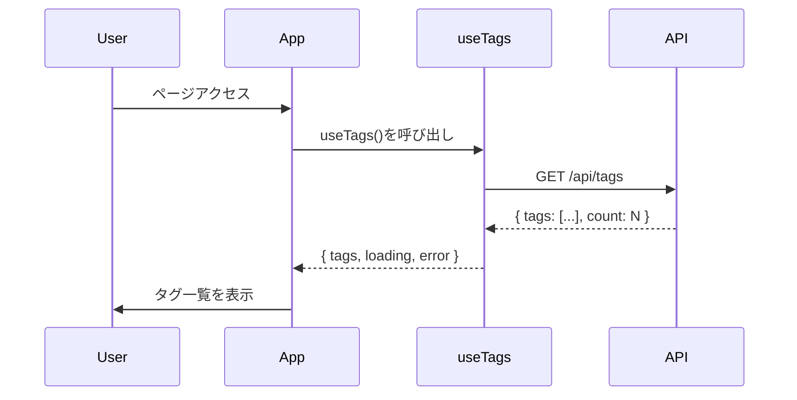
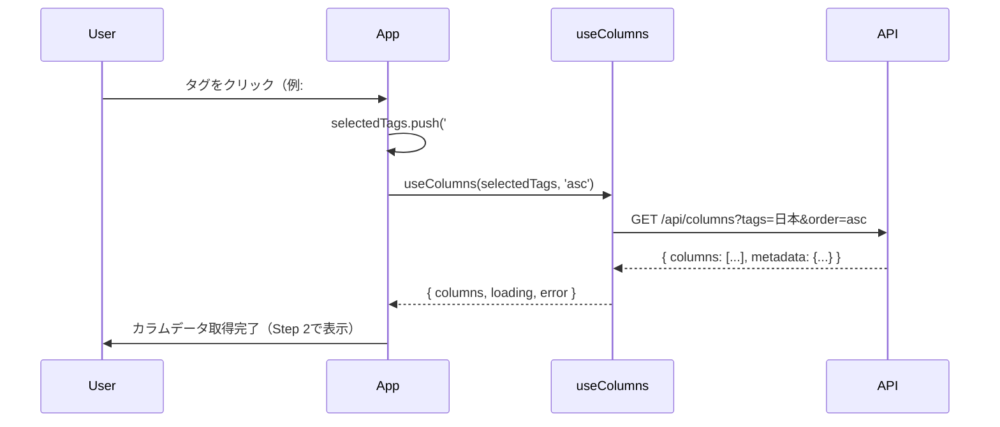
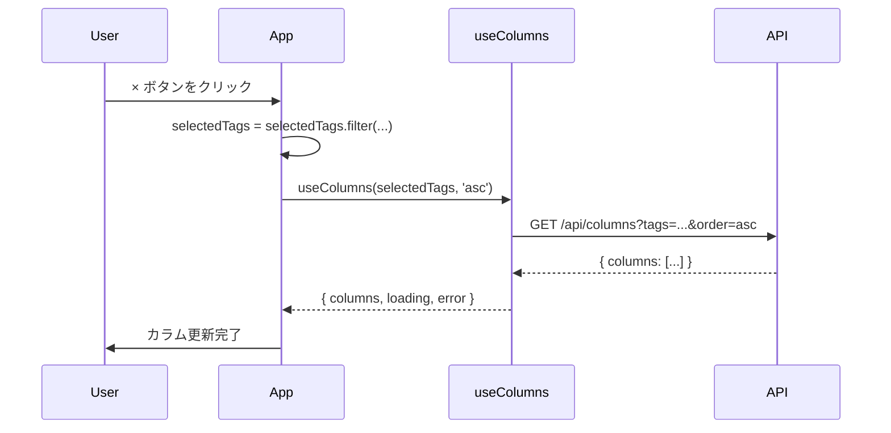

# Phase 3 Step 1: データフェッチとタグ選択UI - 仕様書

## 概要

Phase 3の最初のステップとして、APIからデータを取得し、タグ選択UIを実装する。
マルチカラム表示の基盤となるデータ取得ロジックとタグ管理機能を構築する。

**対象フェーズ**: Phase 3 - UI実装
**ステップ**: Step 1 / 5
**推定工数**: 1日

---

## スコープ

### 含まれる機能

1. ✅ **APIデータ取得ロジック**
   - `/api/tags` - 全タグ一覧取得
   - `/api/events` - 全イベント取得（Timeline列用）
   - `/api/columns` - カラムデータ取得

2. ✅ **カスタムフック実装**
   - `useTags` - タグ一覧取得
   - `useEvents` - イベント一覧取得
   - `useColumns` - カラムデータ取得

3. ✅ **TagSelectorコンポーネント**
   - 選択済みタグ表示（削除ボタン付き）
   - 利用可能なタグ一覧表示（選択ボタン付き）
   - 最大5列制限

4. ✅ **状態管理**
   - 全タグ一覧（`allTags`）
   - 選択中タグ（`selectedTags`）
   - カラムデータ（`columns`）
   - ローディング状態（`loading`）
   - エラー状態（`error`）

### 含まれない機能（後続ステップで実装）

- ❌ Timeline列表示（Step 2）
- ❌ マルチカラムレイアウト（Step 2）
- ❌ イベントカード表示（Step 3）
- ❌ 検索機能（Step 4）
- ❌ ソート切り替え（Step 4）

---

## 受け入れ基準（Acceptance Criteria）

### AC1: APIデータ取得

- [ ] `GET /api/tags` から全タグ一覧を取得できる
- [ ] レスポンスが `{ tags: string[], count: number }` 形式である
- [ ] タグはソート済みである
- [ ] エラー時に適切なエラーメッセージを表示する

### AC2: タグ選択UI表示

- [ ] ページロード時に全タグ一覧が表示される
- [ ] タグボタンをクリックすると選択状態になる
- [ ] 選択済みタグに `×` ボタンが表示される
- [ ] `×` ボタンをクリックすると選択解除される

### AC3: 最大列数制限

- [ ] 最大5列まで選択可能
- [ ] 5列選択時、追加ボタンが無効化される
- [ ] 5列選択時、警告メッセージが表示される

### AC4: カラムデータ取得

- [ ] タグ選択時に `GET /api/columns?tags=X,Y&order=asc` を呼び出す
- [ ] レスポンスが `{ columns: Column[], metadata: {...} }` 形式である
- [ ] 選択タグが変更されるたびにAPIを再取得する

### AC5: ローディング・エラー状態

- [ ] API取得中はローディング表示される
- [ ] API取得失敗時はエラーメッセージが表示される
- [ ] エラー後に再取得可能（リトライボタン）

---

## データフロー

### 初期ロード



### タグ選択



### タグ削除



---

## コンポーネント設計

### ファイル構成

```
src/
├── hooks/
│   ├── useTags.ts         # GET /api/tags
│   ├── useEvents.ts       # GET /api/events
│   └── useColumns.ts      # GET /api/columns
├── components/
│   └── TagSelector/
│       └── TagSelector.tsx
└── App.tsx (更新)
```

---

## カスタムフック仕様

### 1. `useTags`

**目的**: `/api/tags` から全タグ一覧を取得

**インターフェース**:
```typescript
interface UseTagsReturn {
  tags: string[];
  loading: boolean;
  error: string | null;
  refetch: () => void;
}

function useTags(): UseTagsReturn;
```

**実装例**:
```typescript
import { useState, useEffect } from 'react';

export function useTags() {
  const [tags, setTags] = useState<string[]>([]);
  const [loading, setLoading] = useState(false);
  const [error, setError] = useState<string | null>(null);

  const fetchTags = async () => {
    setLoading(true);
    setError(null);
    try {
      const response = await fetch('/api/tags');
      if (!response.ok) throw new Error('タグの取得に失敗しました');
      const data = await response.json();
      setTags(data.tags);
    } catch (err) {
      setError(err instanceof Error ? err.message : '不明なエラー');
    } finally {
      setLoading(false);
    }
  };

  useEffect(() => {
    fetchTags();
  }, []);

  return { tags, loading, error, refetch: fetchTags };
}
```

**テスト項目**:
- [ ] 初回レンダリング時にAPIを呼び出す
- [ ] 成功時に `tags` が更新される
- [ ] 失敗時に `error` が設定される
- [ ] ローディング中は `loading: true` になる
- [ ] `refetch()` で再取得できる

---

### 2. `useEvents`

**目的**: `/api/events` から全イベントを取得

**インターフェース**:
```typescript
import type { Event } from '../lib/parser/types';

interface UseEventsReturn {
  events: Event[];
  loading: boolean;
  error: string | null;
  refetch: () => void;
}

function useEvents(): UseEventsReturn;
```

**実装例**:
```typescript
import { useState, useEffect } from 'react';
import type { Event } from '../lib/parser/types';

export function useEvents() {
  const [events, setEvents] = useState<Event[]>([]);
  const [loading, setLoading] = useState(false);
  const [error, setError] = useState<string | null>(null);

  const fetchEvents = async () => {
    setLoading(true);
    setError(null);
    try {
      const response = await fetch('/api/events');
      if (!response.ok) throw new Error('イベントの取得に失敗しました');
      const data = await response.json();
      setEvents(data.events);
    } catch (err) {
      setError(err instanceof Error ? err.message : '不明なエラー');
    } finally {
      setLoading(false);
    }
  };

  useEffect(() => {
    fetchEvents();
  }, []);

  return { events, loading, error, refetch: fetchEvents };
}
```

**テスト項目**:
- [ ] 初回レンダリング時にAPIを呼び出す
- [ ] 成功時に `events` が更新される
- [ ] 失敗時に `error` が設定される

---

### 3. `useColumns`

**目的**: `/api/columns` からカラムデータを取得

**インターフェース**:
```typescript
import type { Column } from '../lib/utils/types';

interface UseColumnsReturn {
  columns: Column[];
  loading: boolean;
  error: string | null;
  refetch: () => void;
}

function useColumns(
  selectedTags: string[],
  sortOrder: 'asc' | 'desc'
): UseColumnsReturn;
```

**実装例**:
```typescript
import { useState, useEffect } from 'react';
import type { Column } from '../lib/utils/types';

export function useColumns(selectedTags: string[], sortOrder: 'asc' | 'desc' = 'asc') {
  const [columns, setColumns] = useState<Column[]>([]);
  const [loading, setLoading] = useState(false);
  const [error, setError] = useState<string | null>(null);

  const fetchColumns = async () => {
    if (selectedTags.length === 0) {
      setColumns([]);
      return;
    }

    setLoading(true);
    setError(null);
    try {
      const tagsParam = selectedTags.join(',');
      const response = await fetch(`/api/columns?tags=${tagsParam}&order=${sortOrder}`);
      if (!response.ok) throw new Error('カラムデータの取得に失敗しました');
      const data = await response.json();
      setColumns(data.columns);
    } catch (err) {
      setError(err instanceof Error ? err.message : '不明なエラー');
    } finally {
      setLoading(false);
    }
  };

  useEffect(() => {
    fetchColumns();
  }, [selectedTags, sortOrder]);

  return { columns, loading, error, refetch: fetchColumns };
}
```

**テスト項目**:
- [ ] `selectedTags` が変更されるとAPIを呼び出す
- [ ] `sortOrder` が変更されるとAPIを呼び出す
- [ ] `selectedTags` が空配列の場合、APIを呼び出さない
- [ ] 成功時に `columns` が更新される
- [ ] 失敗時に `error` が設定される

---

## TagSelectorコンポーネント仕様

**目的**: タグ選択UIを提供

**Props**:
```typescript
interface TagSelectorProps {
  allTags: string[];
  selectedTags: string[];
  onSelectTag: (tag: string) => void;
  onRemoveTag: (tag: string) => void;
  loading?: boolean;
  error?: string | null;
}
```

**UI構成**:
```
┌─────────────────────────────────────────────────────┐
│ タグ選択                                             │
├─────────────────────────────────────────────────────┤
│ 選択中: [#日本 ×] [#西洋美術 ×] [#科学 ×]            │
│                                                     │
│ (5列選択時) ⚠️ 最大5列まで選択可能です              │
│                                                     │
│ タグ一覧:                                           │
│ [#歴史] [#スポーツ] [#建築] [#文化] [#政治] ...     │
└─────────────────────────────────────────────────────┘
```

**実装例**:
```tsx
import React from 'react';

const MAX_COLUMNS = 5;

interface TagSelectorProps {
  allTags: string[];
  selectedTags: string[];
  onSelectTag: (tag: string) => void;
  onRemoveTag: (tag: string) => void;
  loading?: boolean;
  error?: string | null;
}

export function TagSelector({
  allTags,
  selectedTags,
  onSelectTag,
  onRemoveTag,
  loading = false,
  error = null,
}: TagSelectorProps) {
  const availableTags = allTags.filter((tag) => !selectedTags.includes(tag));
  const isMaxReached = selectedTags.length >= MAX_COLUMNS;

  if (loading) {
    return <div className="text-gray-600">タグを読み込み中...</div>;
  }

  if (error) {
    return <div className="text-red-600">エラー: {error}</div>;
  }

  return (
    <div className="bg-white p-4 rounded-lg shadow">
      <h2 className="text-lg font-semibold mb-4">タグ選択</h2>

      {/* 選択済みタグ */}
      <div className="mb-4">
        <p className="text-sm text-gray-600 mb-2">選択中:</p>
        <div className="flex flex-wrap gap-2">
          {selectedTags.length === 0 ? (
            <p className="text-sm text-gray-400">タグを選択してください</p>
          ) : (
            selectedTags.map((tag) => (
              <button
                key={tag}
                onClick={() => onRemoveTag(tag)}
                className="bg-blue-500 text-white px-3 py-1 rounded-full text-sm hover:bg-blue-600 transition"
                aria-label={`タグ ${tag} を削除`}
              >
                #{tag} ×
              </button>
            ))
          )}
        </div>
      </div>

      {/* 最大列数警告 */}
      {isMaxReached && (
        <div className="mb-4 p-3 bg-yellow-50 border border-yellow-200 rounded text-sm text-yellow-800">
          ⚠️ 最大{MAX_COLUMNS}列まで選択可能です。削除してから追加してください。
        </div>
      )}

      {/* 利用可能なタグ */}
      <div>
        <p className="text-sm text-gray-600 mb-2">タグ一覧:</p>
        <div className="flex flex-wrap gap-2">
          {availableTags.map((tag) => (
            <button
              key={tag}
              onClick={() => onSelectTag(tag)}
              disabled={isMaxReached}
              className={`px-3 py-1 rounded-full text-sm transition ${
                isMaxReached
                  ? 'bg-gray-200 text-gray-400 cursor-not-allowed'
                  : 'bg-gray-100 text-gray-700 hover:bg-gray-200'
              }`}
              aria-label={`タグ ${tag} を選択`}
            >
              #{tag}
            </button>
          ))}
        </div>
      </div>
    </div>
  );
}
```

**テスト項目**:
- [ ] `allTags` からタグボタンが生成される
- [ ] タグボタンクリックで `onSelectTag` が呼ばれる
- [ ] 選択済みタグに `×` ボタンが表示される
- [ ] `×` ボタンクリックで `onRemoveTag` が呼ばれる
- [ ] 5列選択時、追加ボタンが無効化される
- [ ] 5列選択時、警告メッセージが表示される
- [ ] `loading: true` のとき「読み込み中」が表示される
- [ ] `error` があるときエラーメッセージが表示される

---

## App.tsx統合

**状態管理**:
```tsx
import { useState } from 'react';
import { useTags } from './hooks/useTags';
import { useColumns } from './hooks/useColumns';
import { TagSelector } from './components/TagSelector/TagSelector';

function App() {
  const [selectedTags, setSelectedTags] = useState<string[]>([]);
  const [sortOrder, setSortOrder] = useState<'asc' | 'desc'>('asc');

  const { tags, loading: tagsLoading, error: tagsError } = useTags();
  const { columns, loading: columnsLoading, error: columnsError } = useColumns(
    selectedTags,
    sortOrder
  );

  const handleSelectTag = (tag: string) => {
    if (selectedTags.length < 5) {
      setSelectedTags([...selectedTags, tag]);
    }
  };

  const handleRemoveTag = (tag: string) => {
    setSelectedTags(selectedTags.filter((t) => t !== tag));
  };

  return (
    <div className="min-h-screen bg-gray-50">
      <header className="bg-white shadow">
        <div className="max-w-7xl mx-auto py-6 px-4">
          <h1 className="text-3xl font-bold text-gray-900">TimeMosaic</h1>
        </div>
      </header>

      <main className="max-w-7xl mx-auto py-6 px-4">
        <TagSelector
          allTags={tags}
          selectedTags={selectedTags}
          onSelectTag={handleSelectTag}
          onRemoveTag={handleRemoveTag}
          loading={tagsLoading}
          error={tagsError}
        />

        {/* デバッグ表示 */}
        {selectedTags.length > 0 && (
          <div className="mt-6 p-4 bg-blue-50 rounded">
            <p className="text-sm font-semibold">選択中のタグ:</p>
            <p className="text-sm">{selectedTags.join(', ')}</p>
            <p className="text-sm mt-2">カラム数: {columns.length}</p>
            {columnsLoading && <p className="text-sm">カラムデータ取得中...</p>}
            {columnsError && <p className="text-sm text-red-600">エラー: {columnsError}</p>}
          </div>
        )}
      </main>
    </div>
  );
}

export default App;
```

---

## テスト方針

### 手動テスト項目（MVP）

#### 1. タグ一覧表示
- [ ] ページロード時にタグ一覧が表示される
- [ ] サンプルデータのタグ（歴史、日本、スポーツ等）が含まれる
- [ ] タグがソート済みである

#### 2. タグ選択
- [ ] タグボタンをクリックすると「選択中」エリアに移動する
- [ ] 選択済みタグに `×` ボタンが表示される
- [ ] 複数タグを選択できる

#### 3. タグ削除
- [ ] `×` ボタンをクリックすると選択解除される
- [ ] タグ一覧に戻る

#### 4. 最大列数制限
- [ ] 5つのタグを選択できる
- [ ] 6つ目のタグを選択しようとすると無効化される
- [ ] 警告メッセージが表示される
- [ ] タグを削除すると再度選択可能になる

#### 5. API連携
- [ ] タグ選択時にコンソールでAPI呼び出しを確認できる
- [ ] デバッグ表示でカラム数が更新される

#### 6. エラーハンドリング
- [ ] 開発サーバーを停止してエラー表示を確認
- [ ] エラーメッセージが表示される

### 将来的な自動テスト（Vitest + React Testing Library）

```typescript
// 例: TagSelector.test.tsx
describe('TagSelector', () => {
  it('renders all available tags', () => {
    const allTags = ['歴史', '日本', 'スポーツ'];
    render(<TagSelector allTags={allTags} selectedTags={[]} ... />);
    expect(screen.getByText('#歴史')).toBeInTheDocument();
  });

  it('calls onSelectTag when tag is clicked', () => {
    const onSelectTag = vi.fn();
    render(<TagSelector allTags={['歴史']} selectedTags={[]} onSelectTag={onSelectTag} ... />);
    fireEvent.click(screen.getByText('#歴史'));
    expect(onSelectTag).toHaveBeenCalledWith('歴史');
  });

  it('disables tag selection when max limit is reached', () => {
    const selectedTags = ['A', 'B', 'C', 'D', 'E'];
    render(<TagSelector allTags={['F']} selectedTags={selectedTags} ... />);
    expect(screen.getByText('#F')).toBeDisabled();
  });
});
```

---

## 実装チェックリスト

### カスタムフック

- [ ] `src/hooks/useTags.ts` を作成
- [ ] `src/hooks/useEvents.ts` を作成
- [ ] `src/hooks/useColumns.ts` を作成
- [ ] 各フックのエラーハンドリング実装
- [ ] 各フックのローディング状態管理

### コンポーネント

- [ ] `src/components/TagSelector/TagSelector.tsx` を作成
- [ ] 選択済みタグ表示
- [ ] 利用可能なタグ表示
- [ ] 最大5列制限実装
- [ ] ローディング・エラー表示

### App.tsx統合

- [ ] カスタムフックをインポート
- [ ] 状態管理（`selectedTags`, `sortOrder`）
- [ ] `TagSelector` コンポーネント配置
- [ ] デバッグ表示追加

### 手動テスト

- [ ] タグ一覧表示確認
- [ ] タグ選択/削除動作確認
- [ ] 最大5列制限確認
- [ ] API呼び出し確認（開発者ツール）
- [ ] エラー表示確認

---

## 成功基準

- [x] バックエンドAPI実装済み（`/api/tags`, `/api/events`, `/api/columns`）
- [ ] タグ一覧が表示される
- [ ] タグを選択すると「選択中」エリアに移動する
- [ ] タグを削除すると「タグ一覧」に戻る
- [ ] 最大5列制限が動作する
- [ ] API呼び出しが正常に動作する（開発者ツール確認）
- [ ] ローディング・エラー表示が適切

---

## 次のステップ（Step 2）

Step 1完了後、以下を実装：
- Timeline列コンポーネント
- マルチカラムレイアウト
- CSS Grid による位置合わせ
- 横スクロール対応

---

## 備考

### デザインシステム

Tailwind CSS クラスを使用：
- プライマリカラー: `bg-blue-500`, `text-blue-600`
- セカンダリカラー: `bg-gray-100`, `text-gray-600`
- エラー: `bg-red-50`, `text-red-600`
- 警告: `bg-yellow-50`, `text-yellow-800`

### アクセシビリティ

- `aria-label` でスクリーンリーダー対応
- `disabled` 属性で無効化状態を明示
- キーボード操作（`Tab` キーでフォーカス移動）

### パフォーマンス

- `useMemo` / `useCallback` は Step 4（検索機能）で追加
- 現時点では素朴な実装でOK
