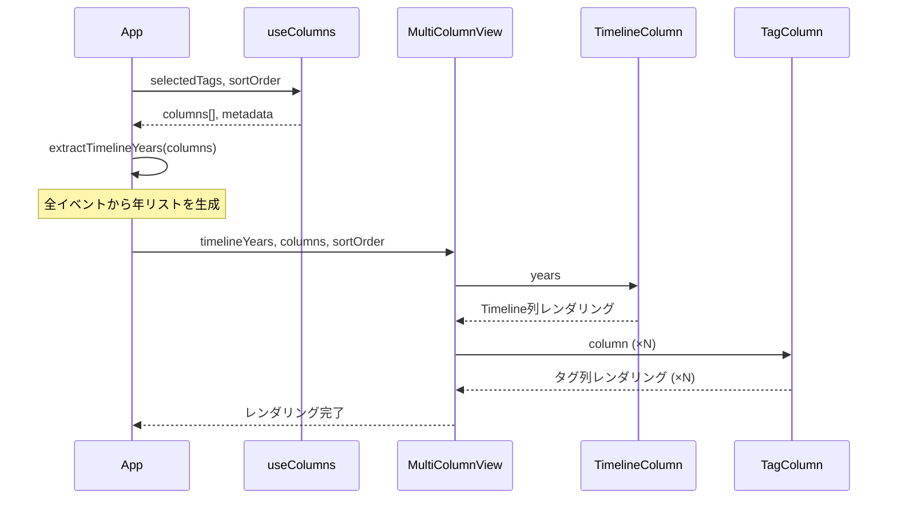

# Phase 3 Step 2: Timeline列とマルチカラムレイアウト

## 概要

Phase 3 Step 2では、**Timeline列（共通年表）** と **マルチカラムレイアウト** を実装します。

Step 1で実装したタグ選択UIで選択したタグに応じて、各タグのイベント列とTimeline列を並べて表示し、異なる領域のイベントの **同時代性** を可視化します。

---

## スコープ

### ✅ 含まれる機能

- **MultiColumnView コンポーネント**: Timeline列 + タグ列を横並び表示
- **TimelineColumn コンポーネント**: 全イベントの年を表示する共通年表
- **TagColumn コンポーネント**: タグごとのイベント列を表示（簡易版）
- **年リスト生成ロジック**: 全イベントから重複なしの年リストを生成
- **CSS Grid レイアウト**: 年ごとの行で自動整列
- **横スクロール対応**: 複数カラムを横スクロールで表示

### ❌ 除外する機能（Step 3以降で実装）

- EventCard コンポーネントの詳細実装（Step 3）
- EventDetailModal コンポーネント（Step 3）
- タグハイライト機能（Step 3）
- 検索機能（Step 4）
- ソート切り替え（Step 4）
- レスポンシブ対応（Step 5）

---

## 受け入れ基準

### AC1: Timeline列の表示

**Given**: タグが1つ以上選択されている
**When**: MultiColumnView が表示される
**Then**:
- Timeline列が最左端に固定幅で表示される
- 全イベントから抽出した年が昇順または降順で表示される
- 年は重複なく表示される
- 各年の間に縦線（│）が表示される

### AC2: タグ列の表示

**Given**: タグが1つ以上選択されている
**When**: MultiColumnView が表示される
**Then**:
- 選択したタグごとに列が表示される
- 各列のヘッダーにタグ名（`#タグ名`）が表示される
- 各列にそのタグを持つイベントが表示される
- イベントは年号順（昇順/降順）でソートされている

### AC3: CSS Grid による年の整列

**Given**: Timeline列とタグ列が表示されている
**When**: 同じ年にイベントが存在する
**Then**:
- Timeline列の年と、タグ列のイベントが同じ行に配置される
- 視覚的に水平に揃っている

### AC4: 横スクロール

**Given**: 3列以上のタグが選択されている
**When**: 画面幅を超える列数が表示される
**Then**:
- 横スクロールバーが表示される
- Timeline列は固定（スクロールしても左端に表示）
- タグ列のみ横スクロールできる

### AC5: 空状態の表示

**Given**: タグが選択されていない
**When**: App が表示される
**Then**:
- MultiColumnView は表示されない
- 「タグを選択してください」等のメッセージは表示しない（Step 1の UI のみ表示）

---

## データフロー



---

## コンポーネント設計

### 1. MultiColumnView

**責務**:
- Timeline列とタグ列を横並びに配置
- CSS Grid レイアウトで年ごとの行を整列
- 横スクロール対応

**Props**:
```typescript
interface MultiColumnViewProps {
  timelineYears: number[];
  columns: Column[];
  sortOrder: 'asc' | 'desc';
}
```

**実装例**:
```tsx
export function MultiColumnView({ timelineYears, columns, sortOrder }: MultiColumnViewProps) {
  // 年 → 行番号のマッピング
  const yearToRowMap = useMemo(() => {
    return new Map(timelineYears.map((year, index) => [year, index + 2])); // +2 はヘッダー行分
  }, [timelineYears]);

  return (
    <div className="overflow-x-auto bg-white rounded-lg shadow">
      <div
        className="grid"
        style={{
          gridTemplateRows: `60px ${timelineYears.map(() => 'auto').join(' ')}`,
          gridTemplateColumns: `120px repeat(${columns.length}, 300px)`,
        }}
      >
        {/* Timeline列 */}
        <TimelineColumn years={timelineYears} yearToRowMap={yearToRowMap} />

        {/* タグ列 */}
        {columns.map((column, colIndex) => (
          <TagColumn
            key={column.tag}
            column={column}
            colIndex={colIndex}
            yearToRowMap={yearToRowMap}
          />
        ))}
      </div>
    </div>
  );
}
```

---

### 2. TimelineColumn

**責務**:
- 年のリストを縦に表示
- 各年の間に縦線を表示
- CSS Grid の行番号で配置

**Props**:
```typescript
interface TimelineColumnProps {
  years: number[];
  yearToRowMap: Map<number, number>;
}
```

**実装例**:
```tsx
export function TimelineColumn({ years, yearToRowMap }: TimelineColumnProps) {
  return (
    <>
      {/* ヘッダー */}
      <div
        style={{ gridRow: 1, gridColumn: 1 }}
        className="p-4 font-semibold text-gray-700 border-r border-b bg-gray-50"
      >
        Timeline
      </div>

      {/* 年リスト */}
      {years.map((year) => {
        const rowIndex = yearToRowMap.get(year);
        return (
          <div
            key={year}
            style={{ gridRow: rowIndex, gridColumn: 1 }}
            className="p-4 border-r border-b text-center"
          >
            <div className="font-bold text-gray-800">{year}</div>
            <div className="text-gray-400 text-2xl">│</div>
          </div>
        );
      })}
    </>
  );
}
```

---

### 3. TagColumn

**責務**:
- タグ名をヘッダーに表示
- そのタグを持つイベントを年ごとに配置
- CSS Grid の行番号で配置

**Props**:
```typescript
interface TagColumnProps {
  column: Column;
  colIndex: number;
  yearToRowMap: Map<number, number>;
}
```

**実装例（簡易版）**:
```tsx
export function TagColumn({ column, colIndex, yearToRowMap }: TagColumnProps) {
  return (
    <>
      {/* ヘッダー */}
      <div
        style={{ gridRow: 1, gridColumn: colIndex + 2 }}
        className="p-4 font-semibold text-blue-600 border-r border-b bg-blue-50"
      >
        #{column.tag}
      </div>

      {/* イベントリスト（簡易版） */}
      {column.events.map((event) => {
        const rowIndex = yearToRowMap.get(event.date.year);
        return (
          <div
            key={event.id}
            style={{ gridRow: rowIndex, gridColumn: colIndex + 2 }}
            className="p-4 border-r border-b bg-white hover:bg-gray-50 cursor-pointer"
          >
            <div className="text-sm text-gray-600">
              {event.date.month && event.date.day
                ? `${event.date.year}-${String(event.date.month).padStart(2, '0')}-${String(event.date.day).padStart(2, '0')}`
                : event.date.year}
            </div>
            <div className="font-medium text-gray-900">{event.title}</div>
            <div className="text-xs text-gray-500 mt-1">
              {event.tags.map((tag) => `#${tag}`).join(' ')}
            </div>
          </div>
        );
      })}
    </>
  );
}
```

**Note**: Step 3 で EventCard コンポーネントに置き換えます。

---

## ユーティリティ関数

### extractTimelineYears

全イベントから年リストを抽出し、ソート順に応じて返します。

```typescript
/**
 * カラムデータから Timeline 用の年リストを抽出
 *
 * @param columns カラムデータ
 * @param sortOrder ソート順
 * @returns 重複なしの年リスト（ソート済み）
 */
export function extractTimelineYears(
  columns: Column[],
  sortOrder: 'asc' | 'desc'
): number[] {
  // 全イベントから年を抽出
  const allYears = columns.flatMap((column) =>
    column.events.map((event) => event.date.year)
  );

  // 重複削除
  const uniqueYears = Array.from(new Set(allYears));

  // ソート
  uniqueYears.sort((a, b) => (sortOrder === 'asc' ? a - b : b - a));

  return uniqueYears;
}
```

---

## App.tsx への統合

Step 1 で実装した App.tsx に MultiColumnView を追加します。

```tsx
import { useState } from 'react';
import { useTags } from './hooks/useTags';
import { useColumns } from './hooks/useColumns';
import { TagSelector } from './components/TagSelector/TagSelector';
import { MultiColumnView } from './components/MultiColumnView/MultiColumnView';
import { extractTimelineYears } from './lib/utils';

function App() {
  const { tags, loading: tagsLoading, error: tagsError } = useTags();
  const [selectedTags, setSelectedTags] = useState<string[]>([]);
  const [sortOrder, setSortOrder] = useState<'asc' | 'desc'>('asc');

  const { columns, loading: columnsLoading } = useColumns(selectedTags, sortOrder);

  const handleSelectTag = (tag: string) => {
    if (selectedTags.length < 5 && !selectedTags.includes(tag)) {
      setSelectedTags([...selectedTags, tag]);
    }
  };

  const handleRemoveTag = (tag: string) => {
    setSelectedTags(selectedTags.filter((t) => t !== tag));
  };

  // Timeline用の年リストを生成
  const timelineYears = extractTimelineYears(columns, sortOrder);

  return (
    <div className="min-h-screen bg-gray-50">
      <header className="bg-white shadow">
        <div className="max-w-7xl mx-auto py-6 px-4">
          <h1 className="text-3xl font-bold text-gray-900">TimeMosaic</h1>
          <p className="mt-2 text-sm text-gray-600">
            歴史的出来事を時系列で可視化するタイムラインビューア
          </p>
        </div>
      </header>

      <main className="max-w-7xl mx-auto py-6 px-4 space-y-6">
        {/* タグ選択UI（Step 1） */}
        <TagSelector
          allTags={tags}
          selectedTags={selectedTags}
          onSelectTag={handleSelectTag}
          onRemoveTag={handleRemoveTag}
          loading={tagsLoading}
          error={tagsError}
        />

        {/* マルチカラムビュー（Step 2） */}
        {selectedTags.length > 0 && (
          <>
            {columnsLoading ? (
              <div className="bg-white p-8 rounded-lg shadow text-center">
                <p className="text-gray-600">カラムデータを読み込み中...</p>
              </div>
            ) : (
              <MultiColumnView
                timelineYears={timelineYears}
                columns={columns}
                sortOrder={sortOrder}
              />
            )}
          </>
        )}
      </main>
    </div>
  );
}

export default App;
```

---

## ファイル構成

```
src/
├── components/
│   ├── TagSelector/
│   │   ├── TagSelector.tsx
│   │   └── TagSelector.test.tsx
│   ├── MultiColumnView/
│   │   ├── MultiColumnView.tsx
│   │   └── MultiColumnView.test.tsx
│   ├── TimelineColumn/
│   │   ├── TimelineColumn.tsx
│   │   └── TimelineColumn.test.tsx
│   └── TagColumn/
│       ├── TagColumn.tsx
│       └── TagColumn.test.tsx
├── lib/
│   └── utils/
│       ├── index.ts
│       └── extractTimelineYears.ts (新規)
├── hooks/
│   ├── useTags.ts
│   ├── useEvents.ts
│   └── useColumns.ts
└── App.tsx
```

---

## テストケース

### MultiColumnView.test.tsx

```typescript
describe('MultiColumnView', () => {
  it('Timeline列とタグ列が表示される', () => {
    const timelineYears = [1543, 1945, 1964];
    const columns = [
      {
        tag: '歴史',
        events: [
          { id: '1', date: { year: 1543 }, title: '鉄砲伝来', tags: ['歴史'], raw: '' },
        ],
      },
    ];

    render(<MultiColumnView timelineYears={timelineYears} columns={columns} sortOrder="asc" />);

    // Timeline列のヘッダー
    expect(screen.getByText('Timeline')).toBeInTheDocument();

    // 年が表示される
    expect(screen.getByText('1543')).toBeInTheDocument();
    expect(screen.getByText('1945')).toBeInTheDocument();
    expect(screen.getByText('1964')).toBeInTheDocument();

    // タグ列のヘッダー
    expect(screen.getByText('#歴史')).toBeInTheDocument();

    // イベントが表示される
    expect(screen.getByText('鉄砲伝来')).toBeInTheDocument();
  });

  it('複数のタグ列が表示される', () => {
    const timelineYears = [1543, 1945];
    const columns = [
      { tag: '歴史', events: [mockEvent1] },
      { tag: '日本', events: [mockEvent2] },
      { tag: 'スポーツ', events: [mockEvent3] },
    ];

    render(<MultiColumnView timelineYears={timelineYears} columns={columns} sortOrder="asc" />);

    expect(screen.getByText('#歴史')).toBeInTheDocument();
    expect(screen.getByText('#日本')).toBeInTheDocument();
    expect(screen.getByText('#スポーツ')).toBeInTheDocument();
  });

  it('CSS Gridのカラム数が正しく設定される', () => {
    const timelineYears = [1543];
    const columns = [{ tag: '歴史', events: [] }, { tag: '日本', events: [] }];

    const { container } = render(
      <MultiColumnView timelineYears={timelineYears} columns={columns} sortOrder="asc" />
    );

    const grid = container.querySelector('.grid');
    expect(grid).toHaveStyle({ gridTemplateColumns: '120px repeat(2, 300px)' });
  });
});
```

### TimelineColumn.test.tsx

```typescript
describe('TimelineColumn', () => {
  it('年リストが表示される', () => {
    const years = [1543, 1945, 1964];
    const yearToRowMap = new Map([
      [1543, 2],
      [1945, 3],
      [1964, 4],
    ]);

    render(<TimelineColumn years={years} yearToRowMap={yearToRowMap} />);

    expect(screen.getByText('Timeline')).toBeInTheDocument();
    expect(screen.getByText('1543')).toBeInTheDocument();
    expect(screen.getByText('1945')).toBeInTheDocument();
    expect(screen.getByText('1964')).toBeInTheDocument();
  });

  it('縦線（│）が表示される', () => {
    const years = [1543];
    const yearToRowMap = new Map([[1543, 2]]);

    const { container } = render(<TimelineColumn years={years} yearToRowMap={yearToRowMap} />);

    expect(container.textContent).toContain('│');
  });
});
```

### TagColumn.test.tsx

```typescript
describe('TagColumn', () => {
  it('タグ名がヘッダーに表示される', () => {
    const column = {
      tag: '歴史',
      events: [],
    };
    const yearToRowMap = new Map();

    render(<TagColumn column={column} colIndex={0} yearToRowMap={yearToRowMap} />);

    expect(screen.getByText('#歴史')).toBeInTheDocument();
  });

  it('イベントが表示される', () => {
    const column = {
      tag: '歴史',
      events: [
        { id: '1', date: { year: 1543 }, title: '鉄砲伝来', tags: ['歴史'], raw: '' },
      ],
    };
    const yearToRowMap = new Map([[1543, 2]]);

    render(<TagColumn column={column} colIndex={0} yearToRowMap={yearToRowMap} />);

    expect(screen.getByText('鉄砲伝来')).toBeInTheDocument();
    expect(screen.getByText('1543')).toBeInTheDocument();
  });

  it('年月日がある場合はフォーマット表示される', () => {
    const column = {
      tag: '歴史',
      events: [
        { id: '1', date: { year: 1945, month: 8, day: 15 }, title: '終戦', tags: ['歴史'], raw: '' },
      ],
    };
    const yearToRowMap = new Map([[1945, 2]]);

    render(<TagColumn column={column} colIndex={0} yearToRowMap={yearToRowMap} />);

    expect(screen.getByText('1945-08-15')).toBeInTheDocument();
  });
});
```

### extractTimelineYears.test.ts

```typescript
describe('extractTimelineYears', () => {
  it('全イベントから年リストを抽出する', () => {
    const columns = [
      {
        tag: '歴史',
        events: [
          { id: '1', date: { year: 1543 }, title: '', tags: [], raw: '' },
          { id: '2', date: { year: 1945 }, title: '', tags: [], raw: '' },
        ],
      },
      {
        tag: '日本',
        events: [{ id: '3', date: { year: 1964 }, title: '', tags: [], raw: '' }],
      },
    ];

    const result = extractTimelineYears(columns, 'asc');

    expect(result).toEqual([1543, 1945, 1964]);
  });

  it('重複した年は1つにまとめられる', () => {
    const columns = [
      {
        tag: '歴史',
        events: [{ id: '1', date: { year: 1945 }, title: '', tags: [], raw: '' }],
      },
      {
        tag: '日本',
        events: [{ id: '2', date: { year: 1945 }, title: '', tags: [], raw: '' }],
      },
    ];

    const result = extractTimelineYears(columns, 'asc');

    expect(result).toEqual([1945]);
  });

  it('昇順でソートされる', () => {
    const columns = [
      {
        tag: '歴史',
        events: [
          { id: '1', date: { year: 1964 }, title: '', tags: [], raw: '' },
          { id: '2', date: { year: 1543 }, title: '', tags: [], raw: '' },
          { id: '3', date: { year: 1945 }, title: '', tags: [], raw: '' },
        ],
      },
    ];

    const result = extractTimelineYears(columns, 'asc');

    expect(result).toEqual([1543, 1945, 1964]);
  });

  it('降順でソートされる', () => {
    const columns = [
      {
        tag: '歴史',
        events: [
          { id: '1', date: { year: 1543 }, title: '', tags: [], raw: '' },
          { id: '2', date: { year: 1945 }, title: '', tags: [], raw: '' },
          { id: '3', date: { year: 1964 }, title: '', tags: [], raw: '' },
        ],
      },
    ];

    const result = extractTimelineYears(columns, 'desc');

    expect(result).toEqual([1964, 1945, 1543]);
  });

  it('空のカラムリストの場合は空配列を返す', () => {
    const result = extractTimelineYears([], 'asc');

    expect(result).toEqual([]);
  });
});
```

---

## 手動テストチェックリスト

### 基本機能

- [ ] Timeline列が表示される
- [ ] タグを1つ選択すると、Timeline列 + タグ列1つが表示される
- [ ] タグを2つ選択すると、Timeline列 + タグ列2つが表示される
- [ ] タグを5つ選択すると、Timeline列 + タグ列5つが表示される
- [ ] Timeline列のヘッダーに「Timeline」と表示される
- [ ] タグ列のヘッダーに「#タグ名」と表示される

### Timeline列

- [ ] Timeline列に年が表示される
- [ ] 年は昇順でソートされている（sortOrder='asc'の場合）
- [ ] 年は降順でソートされている（sortOrder='desc'の場合）
- [ ] 各年の間に縦線（│）が表示される
- [ ] 年は重複なく表示される

### タグ列

- [ ] タグ列にそのタグを持つイベントが表示される
- [ ] イベントのタイトルが表示される
- [ ] イベントの年月日が表示される（年のみ、年月日の場合はフォーマット）
- [ ] イベントのタグリストが表示される

### レイアウト

- [ ] Timeline列とタグ列が横並びに表示される
- [ ] 同じ年のイベントが水平に揃っている
- [ ] Timeline列は固定幅（120px）で表示される
- [ ] タグ列は固定幅（300px）で表示される

### 横スクロール

- [ ] 3列以上のタグを選択すると横スクロールバーが表示される
- [ ] 横スクロールが スムーズに動作する
- [ ] Timeline列は固定（スクロールしても左端に表示）される

### エッジケース

- [ ] タグが選択されていない場合、MultiColumnViewは表示されない
- [ ] イベントがない年は、Timeline列のみ表示される（タグ列は空）
- [ ] 同じ年に複数イベントがある場合、縦に並んで表示される

---

## 実装チェックリスト

### Phase 1: ユーティリティ関数

- [ ] `src/lib/utils/extractTimelineYears.ts` を作成
- [ ] `extractTimelineYears` 関数を実装
- [ ] `src/lib/utils/__tests__/extractTimelineYears.test.ts` を作成
- [ ] テスト実行（5個のテストケース）

### Phase 2: TimelineColumn コンポーネント

- [ ] `src/components/TimelineColumn/TimelineColumn.tsx` を作成
- [ ] TimelineColumn コンポーネントを実装
- [ ] `src/components/TimelineColumn/TimelineColumn.test.tsx` を作成
- [ ] テスト実行（2個のテストケース）

### Phase 3: TagColumn コンポーネント

- [ ] `src/components/TagColumn/TagColumn.tsx` を作成
- [ ] TagColumn コンポーネントを実装
- [ ] `src/components/TagColumn/TagColumn.test.tsx` を作成
- [ ] テスト実行（3個のテストケース）

### Phase 4: MultiColumnView コンポーネント

- [ ] `src/components/MultiColumnView/MultiColumnView.tsx` を作成
- [ ] MultiColumnView コンポーネントを実装
- [ ] `src/components/MultiColumnView/MultiColumnView.test.tsx` を作成
- [ ] テスト実行（3個のテストケース）

### Phase 5: App.tsx への統合

- [ ] App.tsx を更新
- [ ] extractTimelineYears を lib/utils から export
- [ ] MultiColumnView を App.tsx に統合
- [ ] Step 1のカラムプレビューを削除

### Phase 6: 手動テスト

- [ ] 開発サーバー起動
- [ ] 手動テストチェックリストを実行
- [ ] 全項目が OK であることを確認

---

## 次のステップ（Step 3）

- EventCard コンポーネントの詳細実装
- EventDetailModal コンポーネント実装
- タグハイライト機能
- モーダル表示機能

---

## 参考資料

- [frontend-spec.md](./frontend-spec.md) - フロントエンド全体仕様
- [phase3-step1-spec.md](./phase3-step1-spec.md) - Step 1 仕様
