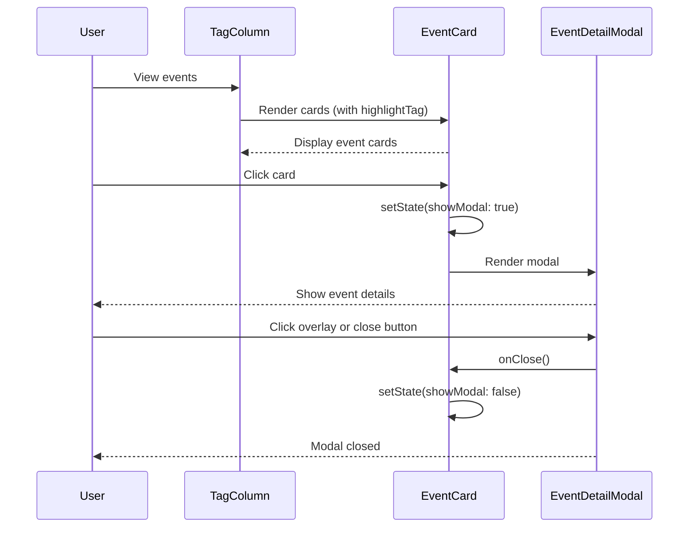

# Phase 3 Step 3: イベントカードとモーダル - 実装仕様書

**作成日**: 2025-12-30
**Phase**: Phase 3 (フロントエンド実装)
**Step**: Step 3 (イベントカードとモーダル)
**担当**: Claude Code

---

## 概要

Step 2で仮実装したイベント表示を、専用のEventCardコンポーネントに置き換え、クリック時に詳細情報を表示するEventDetailModalを実装します。

---

## スコープ

### 含まれるもの

- EventCard コンポーネント（イベントカード表示）
- EventDetailModal コンポーネント（詳細モーダル）
- タグハイライト機能（カラムのタグを強調表示）
- モーダル開閉機能
- TagColumn の EventCard への置き換え

### 含まれないもの

- 検索機能（Step 4）
- ソート切り替え（Step 4）
- レスポンシブ対応の最終調整（Step 5）
- アニメーション（Step 5）

---

## 受け入れ基準

### AC1: EventCard の表示

**Given**: TagColumn が表示されている
**When**: イベントが存在する
**Then**:
- イベントカードが表示される
- 日付（年/年月日）が表示される
- イベントタイトルが表示される
- タグ一覧が表示される（#接頭辞付き）
- 説明文がある場合、最初の50文字 + "..." が表示される

### AC2: タグハイライト機能

**Given**: EventCard が表示されている
**When**: highlightTag プロパティが渡されている
**Then**:
- highlightTag と一致するタグが強調表示される（異なる背景色/文字色）
- 他のタグは通常表示される

### AC3: モーダルの開閉

**Given**: EventCard が表示されている
**When**: カードをクリックする
**Then**:
- EventDetailModal が開く
- モーダルオーバーレイが表示される
- 背景が半透明のオーバーレイで覆われる

**When**: オーバーレイをクリックする
**Then**:
- モーダルが閉じる

**When**: 閉じるボタンをクリックする
**Then**:
- モーダルが閉じる

### AC4: モーダルの表示内容

**Given**: EventDetailModal が開いている
**When**: モーダルが表示される
**Then**:
- イベントタイトルが表示される
- 完全な日付が表示される
- 全タグが表示される（#接頭辞付き）
- 説明文が全文表示される（存在する場合）
- 閉じるボタンが表示される

### AC5: TagColumn との統合

**Given**: TagColumn が表示されている
**When**: EventCard を使用するように更新される
**Then**:
- Step 2 の簡易表示が EventCard に置き換わる
- highlightTag にカラムのタグが渡される
- 既存のテストが引き続き合格する

---

## データフロー



---

## コンポーネント設計

### 1. EventCard

**責務**:
- イベントの要約情報を表示
- highlightTag を強調表示
- クリックでモーダルを開く

**Props**:
```typescript
interface EventCardProps {
  event: Event;
  highlightTag: string;
}
```

**State**:
```typescript
const [showModal, setShowModal] = useState(false);
```

**実装例**:
```tsx
import { useState } from 'react';
import { EventDetailModal } from '../EventDetailModal/EventDetailModal';
import type { Event } from '@/lib/parser/types';

interface EventCardProps {
  event: Event;
  highlightTag: string;
}

export function EventCard({ event, highlightTag }: EventCardProps) {
  const [showModal, setShowModal] = useState(false);

  // 日付フォーマット
  const formatDate = (date: Event['date']): string => {
    if (date.month && date.day) {
      return `${date.year}-${String(date.month).padStart(2, '0')}-${String(date.day).padStart(2, '0')}`;
    } else if (date.month) {
      return `${date.year}-${String(date.month).padStart(2, '0')}`;
    }
    return String(date.year);
  };

  return (
    <>
      <div
        onClick={() => setShowModal(true)}
        className="p-4 border-r border-b bg-white hover:bg-gray-50 cursor-pointer"
      >
        {/* 日付 */}
        <div className="text-sm text-gray-600">{formatDate(event.date)}</div>

        {/* タイトル */}
        <div className="font-medium text-gray-900 mt-1">{event.title}</div>

        {/* タグ */}
        <div className="flex flex-wrap gap-1 mt-2">
          {event.tags.map((tag) => (
            <span
              key={tag}
              className={
                tag === highlightTag
                  ? 'px-2 py-0.5 text-xs rounded bg-blue-100 text-blue-700 font-semibold'
                  : 'px-2 py-0.5 text-xs rounded bg-gray-100 text-gray-600'
              }
            >
              #{tag}
            </span>
          ))}
        </div>

        {/* 説明文（最初の50文字） */}
        {event.description && (
          <div className="text-xs text-gray-500 mt-2">
            {event.description.substring(0, 50)}
            {event.description.length > 50 && '...'}
          </div>
        )}
      </div>

      {/* モーダル */}
      {showModal && (
        <EventDetailModal event={event} onClose={() => setShowModal(false)} />
      )}
    </>
  );
}
```

---

### 2. EventDetailModal

**責務**:
- イベントの完全な情報を表示
- オーバーレイクリックで閉じる
- 閉じるボタンで閉じる

**Props**:
```typescript
interface EventDetailModalProps {
  event: Event;
  onClose: () => void;
}
```

**実装例**:
```tsx
import type { Event } from '@/lib/parser/types';

interface EventDetailModalProps {
  event: Event;
  onClose: () => void;
}

export function EventDetailModal({ event, onClose }: EventDetailModalProps) {
  // 日付フォーマット
  const formatDate = (date: Event['date']): string => {
    if (date.month && date.day) {
      return `${date.year}年${date.month}月${date.day}日`;
    } else if (date.month) {
      return `${date.year}年${date.month}月`;
    }
    return `${date.year}年`;
  };

  return (
    <div
      className="fixed inset-0 bg-black bg-opacity-50 flex items-center justify-center z-50"
      onClick={onClose}
    >
      <div
        className="bg-white rounded-lg shadow-xl max-w-2xl w-full mx-4 max-h-[80vh] overflow-y-auto"
        onClick={(e) => e.stopPropagation()}
      >
        {/* ヘッダー */}
        <div className="p-6 border-b">
          <h2 className="text-2xl font-bold text-gray-900">{event.title}</h2>
          <p className="text-sm text-gray-600 mt-2">日付: {formatDate(event.date)}</p>
        </div>

        {/* タグ */}
        <div className="px-6 py-4 border-b">
          <div className="flex flex-wrap gap-2">
            {event.tags.map((tag) => (
              <span
                key={tag}
                className="px-3 py-1 text-sm rounded bg-blue-100 text-blue-700"
              >
                #{tag}
              </span>
            ))}
          </div>
        </div>

        {/* 説明文 */}
        {event.description && (
          <div className="px-6 py-4">
            <h3 className="font-semibold text-gray-900 mb-2">詳細</h3>
            <p className="text-gray-700 whitespace-pre-wrap">{event.description}</p>
          </div>
        )}

        {/* フッター */}
        <div className="px-6 py-4 border-t flex justify-end">
          <button
            onClick={onClose}
            className="px-4 py-2 bg-gray-600 text-white rounded hover:bg-gray-700"
          >
            閉じる
          </button>
        </div>
      </div>
    </div>
  );
}
```

---

### 3. TagColumn の更新

**変更内容**:
```tsx
// Before (Step 2)
<div className="p-4 border-r border-b bg-white">
  <div className="text-sm text-gray-600">{event.date.year}</div>
  <div className="font-medium text-gray-900">{event.title}</div>
  <div className="text-xs text-gray-500 mt-1">
    {event.tags.map((tag) => `#${tag}`).join(' ')}
  </div>
</div>

// After (Step 3)
<EventCard event={event} highlightTag={column.tag} />
```

---

## ユーティリティ関数

### formatDate

日付フォーマット関数を共通化します。

**ファイル**: `src/lib/utils/formatDate.ts`

```typescript
/**
 * 日付フォーマット関数
 *
 * @param date - 部分的な日付情報
 * @param format - フォーマット形式 ('iso' | 'ja')
 * @returns フォーマットされた日付文字列
 */
export function formatDate(
  date: { year: number; month?: number; day?: number },
  format: 'iso' | 'ja' = 'iso'
): string {
  if (format === 'ja') {
    if (date.month && date.day) {
      return `${date.year}年${date.month}月${date.day}日`;
    } else if (date.month) {
      return `${date.year}年${date.month}月`;
    }
    return `${date.year}年`;
  }

  // ISO format
  if (date.month && date.day) {
    return `${date.year}-${String(date.month).padStart(2, '0')}-${String(date.day).padStart(2, '0')}`;
  } else if (date.month) {
    return `${date.year}-${String(date.month).padStart(2, '0')}`;
  }
  return String(date.year);
}
```

---

## ファイル構成

```
src/
├── components/
│   ├── EventCard/
│   │   ├── EventCard.tsx
│   │   └── EventCard.test.tsx
│   ├── EventDetailModal/
│   │   ├── EventDetailModal.tsx
│   │   └── EventDetailModal.test.tsx
│   ├── TagColumn/
│   │   ├── TagColumn.tsx (更新)
│   │   └── TagColumn.test.tsx (更新)
│   └── MultiColumnView/
│       ├── MultiColumnView.tsx
│       └── MultiColumnView.test.tsx
├── lib/
│   └── utils/
│       ├── formatDate.ts (新規)
│       ├── __tests__/
│       │   └── formatDate.test.ts (新規)
│       └── index.ts (更新)
└── App.tsx
```

---

## テストケース

### formatDate.test.ts

```typescript
describe('formatDate', () => {
  it('年月日を ISO 形式でフォーマットする', () => {
    expect(formatDate({ year: 1945, month: 8, day: 15 })).toBe('1945-08-15');
  });

  it('年月を ISO 形式でフォーマットする', () => {
    expect(formatDate({ year: 1945, month: 8 })).toBe('1945-08');
  });

  it('年のみを ISO 形式でフォーマットする', () => {
    expect(formatDate({ year: 1945 })).toBe('1945');
  });

  it('年月日を日本語形式でフォーマットする', () => {
    expect(formatDate({ year: 1945, month: 8, day: 15 }, 'ja')).toBe('1945年8月15日');
  });

  it('年月を日本語形式でフォーマットする', () => {
    expect(formatDate({ year: 1945, month: 8 }, 'ja')).toBe('1945年8月');
  });

  it('年のみを日本語形式でフォーマットする', () => {
    expect(formatDate({ year: 1945 }, 'ja')).toBe('1945年');
  });
});
```

### EventCard.test.tsx

```typescript
describe('EventCard', () => {
  const mockEvent: Event = {
    id: '1',
    date: { year: 1945, month: 8, day: 15 },
    title: '終戦',
    tags: ['歴史', '日本'],
    description: 'これは説明文です。',
    raw: '',
  };

  it('イベント情報が表示される', () => {
    render(<EventCard event={mockEvent} highlightTag="歴史" />);

    expect(screen.getByText('1945-08-15')).toBeInTheDocument();
    expect(screen.getByText('終戦')).toBeInTheDocument();
    expect(screen.getByText('#歴史')).toBeInTheDocument();
    expect(screen.getByText('#日本')).toBeInTheDocument();
  });

  it('highlightTag が強調表示される', () => {
    render(<EventCard event={mockEvent} highlightTag="歴史" />);

    const historyTag = screen.getByText('#歴史');
    const japanTag = screen.getByText('#日本');

    // bg-blue-100 と text-blue-700 がハイライトタグに適用される
    expect(historyTag).toHaveClass('bg-blue-100', 'text-blue-700');
    // bg-gray-100 と text-gray-600 が通常タグに適用される
    expect(japanTag).toHaveClass('bg-gray-100', 'text-gray-600');
  });

  it('説明文が50文字に切り詰められる', () => {
    const longDescription = 'a'.repeat(100);
    const eventWithLongDesc = { ...mockEvent, description: longDescription };

    render(<EventCard event={eventWithLongDesc} highlightTag="歴史" />);

    const descElement = screen.getByText(/a{50}\.\.\./);
    expect(descElement).toBeInTheDocument();
  });

  it('説明文がない場合は表示されない', () => {
    const eventWithoutDesc = { ...mockEvent, description: undefined };

    const { container } = render(<EventCard event={eventWithoutDesc} highlightTag="歴史" />);

    expect(container.textContent).not.toContain('...');
  });

  it('クリックでモーダルが開く', async () => {
    const user = userEvent.setup();
    render(<EventCard event={mockEvent} highlightTag="歴史" />);

    const card = screen.getByText('終戦').closest('div');
    await user.click(card!);

    // モーダルのタイトルが表示される
    expect(screen.getAllByText('終戦')[0]).toBeInTheDocument();
  });
});
```

### EventDetailModal.test.tsx

```typescript
describe('EventDetailModal', () => {
  const mockEvent: Event = {
    id: '1',
    date: { year: 1945, month: 8, day: 15 },
    title: '終戦',
    tags: ['歴史', '日本'],
    description: 'これは詳細な説明文です。',
    raw: '',
  };

  const mockOnClose = vi.fn();

  it('イベントの詳細情報が表示される', () => {
    render(<EventDetailModal event={mockEvent} onClose={mockOnClose} />);

    expect(screen.getByText('終戦')).toBeInTheDocument();
    expect(screen.getByText('日付: 1945年8月15日')).toBeInTheDocument();
    expect(screen.getByText('#歴史')).toBeInTheDocument();
    expect(screen.getByText('#日本')).toBeInTheDocument();
    expect(screen.getByText('これは詳細な説明文です。')).toBeInTheDocument();
  });

  it('閉じるボタンでモーダルが閉じる', async () => {
    const user = userEvent.setup();
    render(<EventDetailModal event={mockEvent} onClose={mockOnClose} />);

    const closeButton = screen.getByText('閉じる');
    await user.click(closeButton);

    expect(mockOnClose).toHaveBeenCalledTimes(1);
  });

  it('オーバーレイクリックでモーダルが閉じる', async () => {
    const user = userEvent.setup();
    render(<EventDetailModal event={mockEvent} onClose={mockOnClose} />);

    const overlay = screen.getByText('終戦').closest('.fixed');
    await user.click(overlay!);

    expect(mockOnClose).toHaveBeenCalledTimes(1);
  });

  it('モーダルコンテンツクリックでは閉じない', async () => {
    const user = userEvent.setup();
    render(<EventDetailModal event={mockEvent} onClose={mockOnClose} />);

    const content = screen.getByText('終戦').closest('.bg-white');
    await user.click(content!);

    expect(mockOnClose).not.toHaveBeenCalled();
  });

  it('説明文がない場合は詳細セクションが表示されない', () => {
    const eventWithoutDesc = { ...mockEvent, description: undefined };
    render(<EventDetailModal event={eventWithoutDesc} onClose={mockOnClose} />);

    expect(screen.queryByText('詳細')).not.toBeInTheDocument();
  });
});
```

### TagColumn.test.tsx（更新）

```typescript
describe('TagColumn', () => {
  // 既存のテストケースは維持

  it('EventCard を使用してイベントを表示する', () => {
    const column: Column = {
      tag: '歴史',
      events: [
        { id: '1', date: { year: 1543 }, title: '鉄砲伝来', tags: ['歴史'], raw: '' },
      ],
    };
    const yearToRowMap = new Map([[1543, 2]]);

    render(<TagColumn column={column} colIndex={0} yearToRowMap={yearToRowMap} />);

    // EventCard が使用されていることを確認
    expect(screen.getByText('鉄砲伝来')).toBeInTheDocument();
    expect(screen.getByText('1543')).toBeInTheDocument();
    expect(screen.getByText('#歴史')).toBeInTheDocument();
  });
});
```

---

## 実装チェックリスト

### Phase 1: ユーティリティ関数

- [ ] `src/lib/utils/formatDate.ts` を作成
- [ ] `formatDate` 関数を実装（ISO と 日本語形式対応）
- [ ] `src/lib/utils/__tests__/formatDate.test.ts` を作成
- [ ] テスト実行（6個のテストケース）
- [ ] `src/lib/utils/index.ts` から `formatDate` をエクスポート

### Phase 2: EventCard コンポーネント

- [ ] `src/components/EventCard/EventCard.tsx` を作成
- [ ] EventCard コンポーネントを実装
  - [ ] イベント情報表示
  - [ ] タグハイライト機能
  - [ ] モーダル開閉 state 管理
- [ ] `src/components/EventCard/EventCard.test.tsx` を作成
- [ ] テスト実行（5個のテストケース）

### Phase 3: EventDetailModal コンポーネント

- [ ] `src/components/EventDetailModal/EventDetailModal.tsx` を作成
- [ ] EventDetailModal コンポーネントを実装
  - [ ] モーダルオーバーレイ
  - [ ] イベント詳細表示
  - [ ] 閉じる機能（ボタン/オーバーレイ）
- [ ] `src/components/EventDetailModal/EventDetailModal.test.tsx` を作成
- [ ] テスト実行（5個のテストケース）

### Phase 4: TagColumn の更新

- [ ] `src/components/TagColumn/TagColumn.tsx` を更新
  - [ ] EventCard コンポーネントをインポート
  - [ ] 簡易表示を EventCard に置き換え
  - [ ] highlightTag を column.tag で渡す
- [ ] `src/components/TagColumn/TagColumn.test.tsx` を更新
  - [ ] 新しいテストケースを追加
- [ ] テスト実行（既存 + 新規テストケース）

### Phase 5: 統合テスト

- [ ] 全テスト実行（すべて合格することを確認）
- [ ] 開発サーバー起動
- [ ] 手動テストチェックリスト実行

### Phase 6: PR 作成

- [ ] コミット作成
- [ ] feature ブランチにプッシュ
- [ ] Pull Request 作成

---

## 手動テストチェックリスト

### EventCard の表示

- [ ] イベントカードが表示される
- [ ] 日付が正しく表示される（年/年月日）
- [ ] タイトルが表示される
- [ ] タグが表示される（#接頭辞付き）
- [ ] 説明文が50文字で切り詰められる（存在する場合）
- [ ] カーソルを当てるとホバー効果が表示される

### タグハイライト

- [ ] highlightTag と一致するタグが青色で強調表示される
- [ ] 他のタグはグレーで表示される

### モーダル開閉

- [ ] カードをクリックするとモーダルが開く
- [ ] モーダルが画面中央に表示される
- [ ] 背景がオーバーレイで半透明になる
- [ ] オーバーレイをクリックするとモーダルが閉じる
- [ ] 閉じるボタンをクリックするとモーダルが閉じる
- [ ] モーダルコンテンツをクリックしても閉じない

### モーダルの表示内容

- [ ] タイトルが表示される
- [ ] 日付が日本語形式で表示される（例: 1945年8月15日）
- [ ] すべてのタグが表示される
- [ ] 説明文が全文表示される（存在する場合）
- [ ] 説明文がない場合、詳細セクションが表示されない

### 統合動作

- [ ] 複数のイベントカードが正しく表示される
- [ ] 異なるカラムで異なるタグがハイライトされる
- [ ] モーダルを開いている間、背景がスクロールできない
- [ ] モーダルを閉じた後、正常にスクロールできる

---

## 技術的な考慮事項

### アクセシビリティ

- モーダルに適切な ARIA 属性を追加（`role="dialog"`, `aria-modal="true"`）
- キーボード操作対応（ESC キーでモーダルを閉じる）
- フォーカストラップ（モーダル内でのタブ移動）

### パフォーマンス

- モーダルは条件付きレンダリング（`showModal && <Modal />`）
- 不要な再レンダリングを防ぐため、`onClick` ハンドラは適切にメモ化

### スタイリング

- Tailwind CSS を使用
- モーダルの z-index は 50（`z-50`）
- オーバーレイは `bg-black bg-opacity-50`
- モーダルコンテンツは最大幅 2xl（`max-w-2xl`）

---

## 既知の制約・将来の改善

### 現在のスコープ外

1. **モーダルのアニメーション**: フェードイン/アウト（Step 5で実装）
2. **キーボード操作**: ESC キーでの閉じる、フォーカストラップ（将来実装）
3. **背景スクロール無効化**: body のスクロールロック（将来実装）
4. **レスポンシブ対応**: モバイルでのモーダル表示最適化（Step 5で実装）

### 技術的負債

- formatDate 関数の重複（EventCard と EventDetailModal で同じロジック）→ ユーティリティ関数として共通化

---

## 成功基準

- [ ] 全テストが合格する（既存 + 新規テスト）
- [ ] EventCard が正しく表示される
- [ ] タグハイライトが機能する
- [ ] モーダルが正しく開閉する
- [ ] モーダルに完全な情報が表示される
- [ ] 手動テストチェックリストがすべて OK

---

**End of Document**
